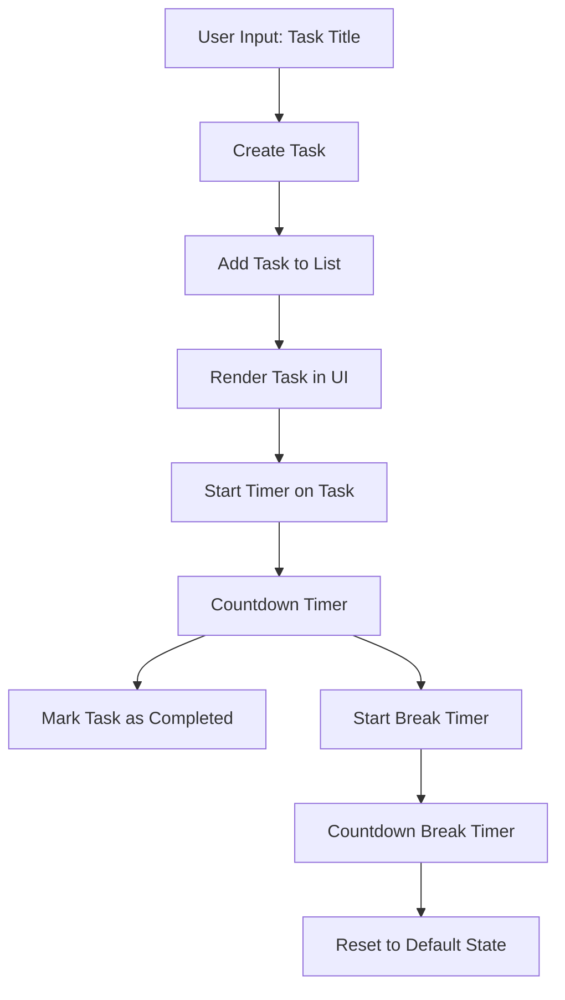

# Pomodoro Task Timer

---
[Pomodoro 🍅](https://axlgoze.github.io/Pomodoro/)

The Pomodoro Task Timer is a productivity tool designed to help users manage their tasks efficiently using the Pomodoro technique. It allows users to create tasks, track their progress with a countdown timer, and take scheduled breaks to maintain focus. This project aims to simplify task management and improve time management skills.

**Tech Stack:**
- **Languages:** JavaScript, HTML, CSS

---

## Visual Flow Map (Architecture)

The following diagram illustrates the flow of data through the system:



---

## Core Components

| **File/Class** | **Primary Responsibility** | **Key Inputs/Outputs** |
|----------------|----------------------------|------------------------|
| **main.js**    | Handles task creation, timer logic, and UI updates | Inputs: Task title, Timer events <br> Outputs: Updated UI, Task status |
| **index.html** | Provides the structure for the app | Inputs: None <br> Outputs: DOM elements for interaction |
| **main.css**   | Styles the application for a modern look | Inputs: None <br> Outputs: Styled UI |

---

## Installation & Usage

### Installation
1. Clone the repository:
   ```bash
   git clone <repository-url>
   ```
2. Navigate to the project directory:
   ```bash
   cd pomodoroJs
   ```
3. Open `index.html` in your browser.

### Usage
1. Enter a task title in the input field.
2. Click **Add Task** to create a new task.
3. Click **Start** on a task to begin the timer.

---

### Design
- **Vanilla JavaScript:** Chosen for simplicity and to avoid external dependencies.
- **Modular Functions:** Each function handles a specific responsibility, ensuring maintainability.
- **Minimalist UI:** Focused on usability and clarity.

### Roadmap
- [ ] Add support for customizable timer durations.
- [ ] Implement persistent storage for tasks (e.g., LocalStorage).
- [ ] Enhance accessibility features.
- [ ] Add sound notifications for timer completion.
- [ ] Refactor code for better scalability.

---

## Contribution & Testing

### How to Contribute
We welcome contributions that prioritize **Clean Code** and **Readability**. To contribute:
1. Fork the repository.
2. Create a new branch for your feature or bug fix.
3. Submit a pull request with a clear description of your changes.

### Testing
To ensure stability, run the following command to execute tests:
```bash
# Placeholder for future test commands
```
### About me

[linkedin](https://www.linkedin.com/in/axel-reyes-wd/)
---